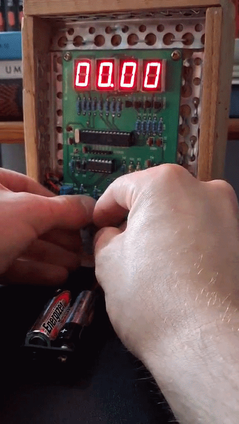

# AVR ATmega Multimeter

A digital, microcontroller-based multimeter capable of measuring voltage and current. The project is designed using an AVR ATmega microcontroller, featuring an 8-segment multiplexed LED display, manual mode switching, dynamic calibration data storage via EEPROM, and data freezing (Hold function).

## Features

- **Voltage Measurement Mode:** Reads and processes analog voltage signals with directional LED indication.
- **Current Measurement Mode:** Measures current with directional LED indication.
- **Multiplexed 8-Segment Display:** Efficient display control using 4 transistors to cycle through digits dynamically.
- **EEPROM Storage:** Auto-calibrates zero-point references on the first boot and updates thresholds dynamically when saving.
- **Data Hold:** Freezes the current measurement on the screen.
- **English Codebase:** Fully documented and clean C code matching industry standards for embedded systems.

## Demo



## Hardware Requirements

- Microcontroller: AVR ATmega (e.g., ATmega8 / ATmega16 / ATmega328p depending on your pinout)
- Display: 4-digit 8-segment LED display (Common Anode controlled via PORTD)
- Transistors: 4x PNP transistors for multiplexing (controlled via PORTC)
- Status LED: Connected to PB2
- Clock: External 12 MHz crystal oscillator (`F_CPU 12000000`)

## Project Structure

- `main.c` - Core logic, ADC measurements, state machine for buttons, calibration, and EEPROM management.
- `LCD8seg.c` / `LCD8seg.h` - Used for handling the multiplexed 8-segment display.

## How It Works (Software Logic)

1. **Initialization:** On the very first boot, the MCU checks the EEPROM. If unprogrammed (`65535`), it loads the default zero-point calibration constants for both voltage and current.
2. **ADC Conversion:** The system uses the built-in Analog-to-Digital Converter to sample voltage or current channel depending on the selected mode, taking a 1000 measurements to smooth out the noise and using a deadband which eliminates flickering of the last digit.
3. **Multiplexing:** The display logic runs via rapid switching of the transistor pins, updating one digit at a time so fast that the human eye sees a steady 4-digit number.
4. **Calibration Save:** Holding down both buttons pushes the current ADC reading as the new "Zero Reference" directly into the non-volatile EEPROM memory.

## Building and Flashing

To compile and flash this project, you will need `avr-gcc` and `avrdude` (or Microchip Studio / MPLAB X).

```bash
# Compile the project
avr-gcc -Wall -Os -DF_CPU=12000000 -mmcu=atmega8 -c main.c LCD8seg.c
avr-gcc -mmcu=atmega8 main.o LCD8seg.o -o main.elf

# Create hex file
avr-objcopy -O ihex -R .eeprom main.elf main.hex

# Flash to the microcontroller (example using usbasp)
avrdude -c usbasp -p m8 -U flash:w:main.hex:i
